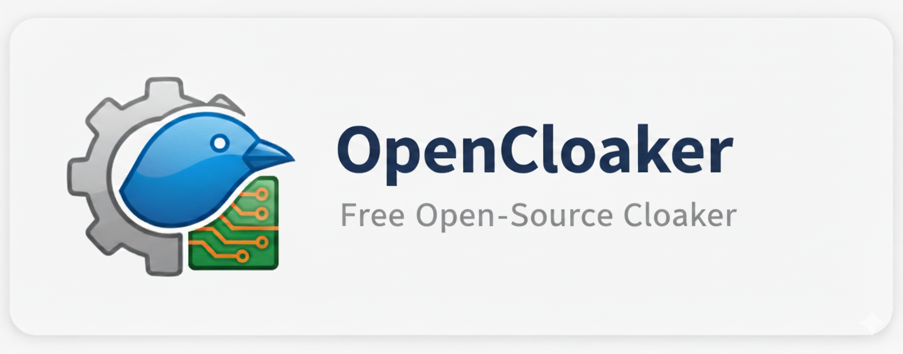

  <picture>
    
  </picture>

   A free, open-source mini-cloaker for digital marketing that uses minimalist domain verification to protect sales pages from cloning.

---
## Overview

### How It Works

OpenCloaker's protection relies on a quick check performed by a JavaScript snippet placed at the very top of your page:

1.  **Domain Verification (Client-Side):** The script checks the current domain (`window.location.hostname`) against your single, pre-configured **authorized domain**.
2.  **Instant Blocking:** If a mismatch occurs (meaning the page is loaded on a cloned site), the script immediately erases the entire content of the HTML document, leaving a blank page.
   
---

## Getting Started

Follow these steps to integrate OpenCloaker into your landing page:

### Prerequisites

* A sales page built with HTML (or a language that outputs HTML).
* The ability to edit your main sales page file.
* The ability to encode your official domain into **Base64** (you can use any free online Base64 encoder).

### Installation and Setup

1.  **Get the Script:** Copy the JavaScript code provided in the next section.
2.  **Configure Your Domain:** You must modify the Base64 string within the script to match your authorized domain.
    * **Original Script Line:** `var _0x12a7="c2V1LWRvbWluaW8uY29t";` (This string currently decodes to `seu-dominio.com`).
    * **Action:** Encode **your official domain** (e.g., `my-official-page.com`) into a Base64 string and replace the content inside the quotes `""` for the variable `_0x12a7`.
3.  **Integration:** Place the modified script tag at the **very top** of your sales page HTML (`index.html` or similar), ideally immediately after the opening `<head>` or `<body>` tag, and before any visible content.

> ⚠️ **Important:** The script must run before the browser starts rendering your page content. This ensures the page is blocked instantly upon detection.
